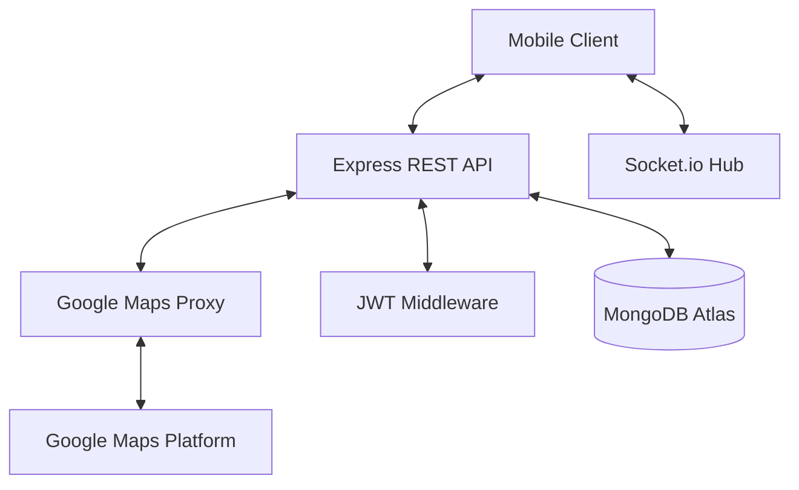

# Commute Server - Backend for Ride Connect

This is the standalone backend for **Commute**, a real-time two-wheeler carpooling application. Built with Node.js, Express, and Socket.io, it handles real-time ride matching, secure authentication, and serves as a secure proxy for Google Maps services.

## 🚀 Architecture Diagram



## 🛠️ Tech Stack
- **Framework**: Node.js & Express
- **Language**: TypeScript
- **Database**: MongoDB Atlas (Mongoose ODM)
- **Real-time**: Socket.io
- **Deployment**: Google Cloud Run (Dockerized)

## 📡 API Endpoints

### 🔐 Auth (`/api/auth`)
- `POST /register`: Register new user data (including profile photo URI).
- `POST /login`: JWT-based authentication.
- `GET /profile`: Fetch current user data (authenticated).
- `PUT /profile`: Update name, phone, aadhar, or photo.
- `PUT /push-token`: Update Expo Push Notification token.

### 🏍️ Rides (`/api/rides`)
- `POST /`: Create a new ride.
- `GET /all`: Fetch all available rides.
- `GET /search`: Search rides by location filters.
- `GET /my-rides`: Fetch user-posted rides.

### 📅 Bookings (`/api/bookings`)
- `POST /`: Create booking request.
- `GET /my-bookings`: Fetch pillion bookings.
- `GET /requests`: Fetch incoming rider requests.
- `PUT /:id/status`: Update booking lifecycle (Accept, Reject, Cancel).

## ☁️ Deployment (Google Cloud Run)

To deploy updates via CLI:
```bash
gcloud run deploy commute-server --source . --region us-central1
```

### Environment Variables
The following variables must be configured in Cloud Run:
- `MONGO_URI`: Atlas connection string.
- `JWT_SECRET`: Secure string for token signing.
- `GOOGLE_MAPS_API_KEY`: Restricted key for server-side usage.
- `PORT`: Set to `5001`.

## 🔒 Security
The server acts as a proxy for all Google Maps API calls. This prevents the Google Maps API Key from being exposed in the mobile application binary, protecting against quota theft.
